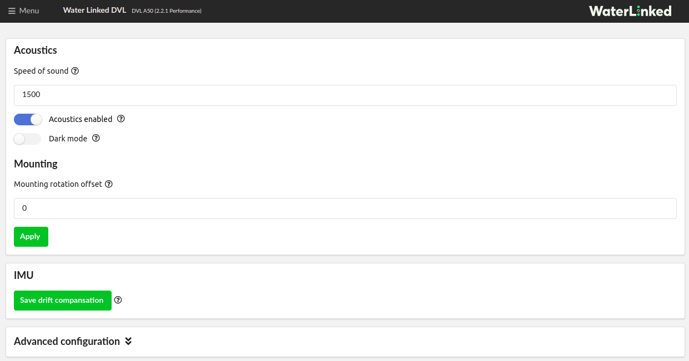

# Configuration

Configuration of the DVL is available in the the GUI by pressing  *Menu -> Configuration*. Output configuration is available by pressing *Menu -> Outputs* . Configuration can also be performed via the [DVL protocol](../dvl-protocol.md).

## Screenshot

## Parameters

Name | Description
-----|------------
Speed of sound | Speed of sound in the environment (sea water, fresh water etc)
Acoustic enabled | Enable/disable sending acoustic waves from the DVL
Mounting rotation offset | Configure DVL mounting direction in relation to vehicle. 0 if LED on DVL is pointing forward on the vehicle. See [axes](../axes.md)
Dark mode | Disable the LED to avoid interference with camera
Save drift compensation | Calibrate the gyro bias in the IMU. Place the DVL on a stationary surface (preferably at the environment operating temperature) and press the button. Recommended to improve [dead reckoning positioning estimation](../dead-reckoning.md)

Advanced configuration

Name | Description
-----|------------
Network configuration | Static IP address or get IP address from DHCP server
System time configuration | Configure Network time protocol (NTP) server to use or set time manually
Factory reset | Reset all configuration of the DVL. Reboot is required.
Reboot | Reboot the DVL

!!!note "Recommended configuration when only serial port is used"
    Configure network to "Static IP" to shorten boot time

!!!note "Recommended configuration when only ethernet is used"
    Configure serial output protocol to "Disabled" to lower latency for TCP protocol
