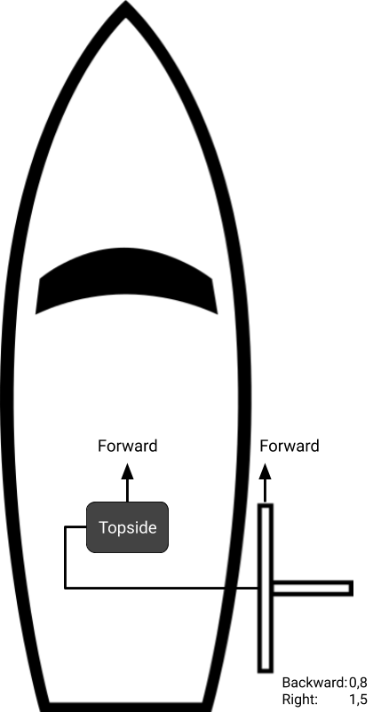
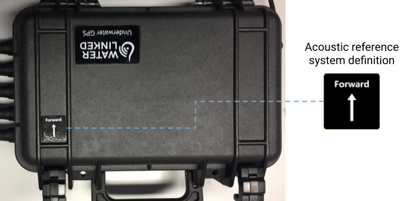

# Baseline

## Quick deploy Antenna Guidelines

You may place the Antenna at any location up to 10m from the Topside housing (limited by cable).

!!! Note
	The Forward direction of the Antenna must align with the Forward direction of the Topside to obtain a correct global position.
	In "Antenna configuration" -> "Advanced settings" a rotation can be specified if aligning forward arrows is impractical.

|                     |                      |
| ------------------- | :------------------- |
| **Line-of-sight**   | Try to place the Antenna so that it has free line-of-sight to the Locator. |
| **Antenna Depth**  | Place the Antenna at 1 meters depth, indicated by the top folding joint of the mast. |
| **Limit search area** | You will get a better position if you help the search algorithm to narrow the  search area. Limit the search range setting to the area where the Locator is  expected to be. |
| **Directivity**     | The Antenna and Locators are fully omnidirectional and transmits/receives equally good in all directions. The only direction with less performance is backwards where the cable enters. |
| **Antenna stability** | Secure the Antenna tightly to the vessel using the provided Ram Mount |
|   |   |

## Receiver-D1 Guidelines

You may place the Receivers at any location within 100m from the Topside housing. In order to ensure the best performance, you should follow a few guidelines:

|                     |                      |
| ------------------- | :------------------- |
| **Line-of-sight**   | Try to place the Receivers so they all have a free line-of-sight to the Locator. |
| **Good Separation** | The system performs better when there is a decent distance between the Receivers. More separation is better, but 2x2 meters is sufficient for good performance.   |
| **Receiver Depth**  | Place the Receivers at a few meters depth. Near the surface there are typically small air bubbles caused by waves. These small air bubbles attenuate the  acoustic signal and can reduce the system performance.              |
| **Limit search area** | You will get a better position if you help the search algorithm to narrow the  search area. Limit the search range setting to the area where the Locator is  expected to be. |
| **Directivity**     | The Receivers and Locators are fully omnidirectional and transmits/receives equally good in all directions. The only direction with less performance is backwards where the cable enters. |
| **Receiver stability** | Add some weight to the Receiver cable just above the Receiver so they hang straight down in the water  |
| **On board GPS**    | If the master electronics is static during operation it is recommended to use the static option for the GPS. This is to remove the inaccuracy of the GPS Receiver in global position. Only use onboard GPS when the reference system is moving, eg. if mounted to a boat.  |
|   |   |

## Reference Systems

In order to calculate the absolute position of the Locator we need to define two reference systems, the acoustic and the global reference system. The global reference system is defined by latitude and longitude and is the reference system used by the GPS and maps.

The acoustic reference system (the Forward axis) is defined by the orientation of the housing. The housing is by definition located in origin (black square). A label on top of the lid indicates the forward direction.

## Boat Example

The illustration bellow shows a typical Receiver configuration when installed on a boat. The Receivers are hanging from the side of the boat, one in each corner. The depth of the Receivers are typically 2-4m, deep enough to get below the hull and get free line-of-sight to the Locator. Notice how the housing defines the origin and coordinate system of the acoustic reference system.

