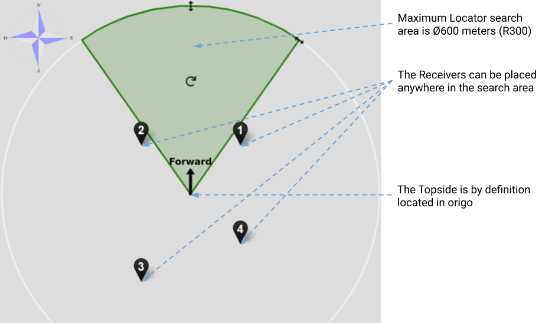

# Baseline

Select *Antenna* or *Receivers* in the tab at the top according to whether an [antenna](../../../antenna) or loose [receivers](../../../receiver-d1) are used.

## Antenna

The antenna can be placed anywhere up to 10m from the topside housing (limited by cable length). Go through the following.

|                     |                      |
| ------------------- | :------------------- |
| **Alignment**       | Ensure that the 'Forward' direction of the antenna as defined by a label on one of its prongs (see also the figure below) is aligned with the 'Forward' direction of the topside housing (indicated by a label on the lid).   If it is not possible physically align them, in *Baseline -> Antenna configuration -> Advanced settings*, specify the clockwise angle in degrees from the forward axis of the topside to the forward axis of the antenna.   If this alignment is not carried out, the [global](#reference-systems) position outputted by UGPS G2 will be incorrect.
| **Line-of-sight**   | Ensure that there will be line-of-sight between the antenna and locator.  |
| **Antenna Depth**  | Ensure that the base of the antenna is at a depth of at least one metre (as indicated by a label upon the top folding joint of the pole of the antenna), to avoid acoustic disturbance |
| **Antenna stability** | Secure the antenna tightly to the vessel using the provided Ram Mount |

Further points of note:

* **Limit search area** : a better position will likely be obtained if the search area is restricted as far as possible in the graphical configuration pane at *Baseline -> Antenna configuration*.
* **Directivity** : the antenna and locators are omnidirectional, that is, signal strength should be good in all directions

## Receivers

Loose receivers can be placed anywhere up to 100m from the topside housing. Go through the following.

|                     |                      |
| ------------------- | :------------------- |
| **Line-of-sight**   | Ensure that all the receivers will have line-of-sight to the locator. |
| **Separation** | Ensure that the receivers are not too close, and are not all in a line. A grid of 2x2 metres should typically be sufficient for good performance, but experiment with different configurations if you experience sub-optimal performance.  |
| **Depth**  | Place the receivers at a depth of at least a metre, to avoid acoustic disturbance.     |
| **Stability** | Consider adding some weight to the receiver cables just above the receivers.  |

Further points of note:

* **Limit search area** : a better position will likely be obtained if the search area is restricted as far as possible in the graphical configuration pane at *Baseline -> Antenna configuration*.   

    

     

* **Directivity** : the receivers and locators are omnidirectional, that is, signal strength should be good in all directions

The figure below indicates a typical loose receiver configuration when the topside unit is upon a boat. The receivers hang from the side of the boat. The origin of the the acoustic frame is in this case a point on the topside unit.

