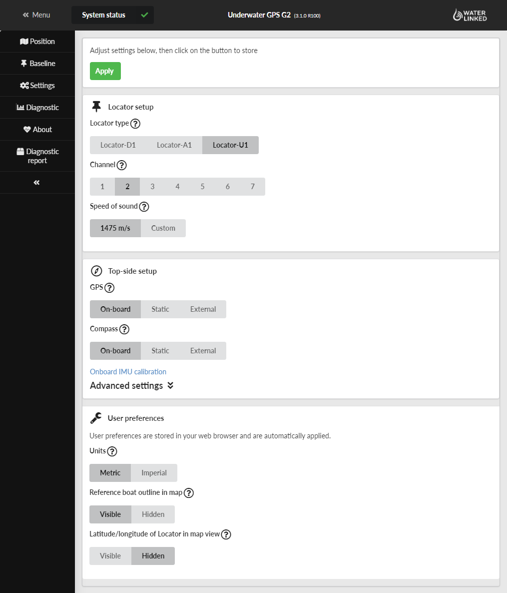

# Settings

## Locator setup

In this section you choose which locator you are using with the system and on which channel it is sending. The Water Linked default channel is 2 and this is the best channel for long distance operation. If using the Locator-U1 the channel needs to macth the rotary switch at the back of the U1.

!!! warning
    If you are using the Locator-A1, you need to provid depth information to the topside unit. Description on how to do this is found [here](../integration/api.md#providing-depth-to-system-when-using-locator-a1).

# Channel overview

The channels avaiable for Underwater GPS G2 and what frequency band they are using are shown in the table below.

| From (kHz) | To (kHz) | Channels using this frequency band |
|-------|------|------|
| 31.25 | 62.25 | 1 |
| 62.25 | 93.75 | 2 (16) |
| 93.75 | 125.00 | 3 (16) |
| 125.00 | 156.00 |  4 (17) |
| 156.00 | 187.00 | 5 (17) |
| 187.00 | 218.00 | 6 (18) |
| 218.00 | 250.00 | 7 (18) |

Please note that the Underwater GPS Explorer kit channels 16, 17, 18 overlaps and all channels overlaps with Modem M64.

## Topside Setup

In this section you have the option to choose which GPS and IMU source you are going to use. We strongly advise to use static or external GPS when operation allow for it. Because the master-D1 electronics has a standard GPS receiver it has a standard deviation of around 2-3 meters.

How to input external GPS and IMU with the API is decribed [here](../integration/api.md).

## User preferences

In the user preferences section you can select the unit of measurments you want to use. We support both Metric and Imperial. You can also select if you want a dummy boat to be displayed on the map pages and the receiver configuration page.
