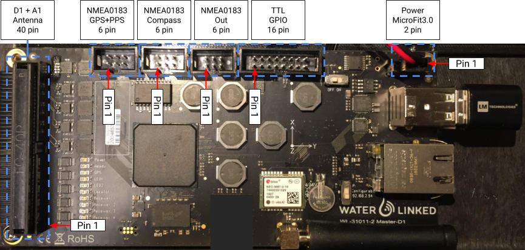
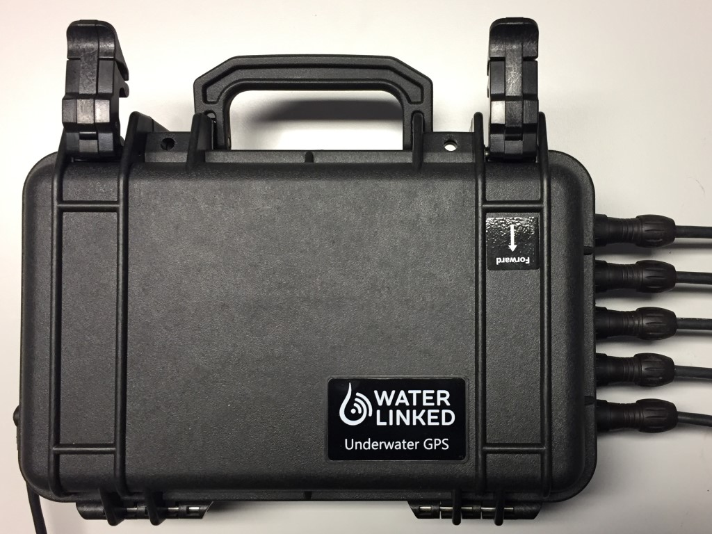

# Hardware Setup

## Connectors

### External

\* *Locator-D1 is not compatible with the [BlueROV2 Integration Kit](./integration/bluerov-integration.md).*

### Internal

!!! Note
	*NC*: Not Connected.

	*DNC*: Do Not Connect, pins used for production.

	**GND**: Boldface indicate power lines (12 V, 3.3 V, VIN, GND).

#### 40 pin Molex Interface

| Signal    | Pin | Pin | Signal    | Function |
| --------- | --: | :-- | :-------- | :-------: |
| GPIO 2\*  | 1   | 2   | GPIO 3    |  |
| D1 TX+    | 3   | 4   | D1 TX-    | Locator-D1 |
| D1 RX+    | 5   | 6   | D1 RX-    | \| |
| **GND**   | 7   | 8   | **12 V**  | Power out |
| R1 TX+    | 9   | 10  | R1 TX-    | Receiver-D1 |
| R1 RX+    | 11  | 12  | R1 RX-    | \| |
| **GND**   | 13  | 14  | **12 V**  | Power out |
| R2 TX+    | 15  | 16  | R2 TX-    | Receiver-D1 |
| R2 RX+    | 17  | 18  | R2 RX-    | \| |
| **GND**   | 19  | 20  | **12 V**  | Power out |
| R3 TX+    | 21  | 22  | R3 TX-    | Receiver-D1 |
| R3 RX+    | 23  | 24  | R3 RX-    | \| |
| **GND**   | 25  | 26  | **12 V**  | Power out |
| R4 TX+    | 27  | 28  | R4 TX-    | Receiver-D1 |
| R4 RX+    | 29  | 30  | R4 RX-    | \| |
| ANT RX 1+ | 31  | 32  | ANT RX 1- | Antenna  |
| ANT RX 2+ | 33  | 34  | ANT RX 2- | \| |
| ANT RX 3+ | 35  | 36  | ANT RX 3- | \| |
| ANT RX 4+ | 37  | 38  | ANT RX 4- | \| |
| A1 TX+    | 39  | 40  | A1 TX-    | Locator-A1 |

\* *Used to control relays for switching between Receivers and Antenna.*

#### 6 pin NMEA 0183 GPS + PPS

| Signal       | Pin | Pin | Signal |
| ------------ | --: | :-- | :----- |
| **GND**      | 1   | 2   | **12 V** |
| NMEA GPS TX  | 3   | 4   | NMEA GPS RX |
| NMEA GPS PPS | 5   | 6   | **GND** |

#### 6 pin NMEA 0183 Compass

| Signal           | Pin | Pin | Signal |
| ---------------- | --: | :-- | :----- |
| **GND**          | 1   | 2   | **12 V** |
| NMEAS COMPASS TX | 3   | 4   | NMEA COMPASS RX |
| *NC*             | 5   | 6   | **GND** |

#### 6 pin NMEA 0183 Out

| Signal       | Pin | Pin | Signal |
| ------------ | --: | :-- | :----- |
| **GND**      | 1   | 2   | **12 V** |
| NMEA OUT     | 3   | 4   | *NC* |
| *NC*         | 5   | 6   | **GND** |

#### 16 pin TTL GPIO

| Signal       | Pin | Pin | Signal |
| ------------ | --: | :-- | :----- |
| **GND**      | 1   | 2   | **12 V** |
| *DNC*        | 3   | 4   | *DNC* |
| *DNC*        | 5   | 6   | *DNC* |
| *DNC*        | 7   | 8   | *DNC* |
| **GND**      | 9   | 10  | PPS OUT |
| **GND**      | 11  | 12  | PPS IN |
| GPIO 0       | 13  | 14  | GPIO 1 |
| **GND**      | 15  | 16  | **3.3 V** |

!!! Note
	TTL voltage: 3.3 V (5.0 V tolerant).

#### 2 pin MicroFit 3.0 Power

| Signal       | Pin | Pin | Signal |
| ------------ | --: | :-- | :----- |
| **GND**      | 1   | 2   | **VIN**\* |

\* *10 - 30 VDC, 0.7 A (12 V nominal).*

Fits Molex Micro-Fit 3.0 43645 series.

### Receiver-D1 setup

* Connect the four Receiver-D1 cables to bulkheads marked "Receiver 1" to "Receiver 4" on the housing.

* If using the Locator-D1, connect this to the bulkhead marked "Locator" on the housing.

* If using the Locator-A1, connect this to the bulkhead marked "Locator" on the housing.

* If using the Locator-U1, no connections to the housing is needed. Just power the Locator and make sure both status leds on U1 and Master-D1 are solid green.

## IMU

The master electronics has an built in IMU used to provide the orientation of the master electronics. This is used in combination with the acoustic position and GPS to generate the global position of the Locator.

### IMU Calibration

For the IMU to work properly it needs to be calibrated. The calibration data is stored when full calibration is obtained for faster calibration on restart of the system. If the system is started on a new location a new calibration is needed for the IMU to work as intended.

To calibrate the IMU disconnect all Recivers and Locator cables, but leave power and Ethernet connected. This is to prevent damaging the cables and connector when performing the calibration. While looking at the top bar in the web GUI on the IMU status, move the peli case in a figure of 8 until all the bars are green.
