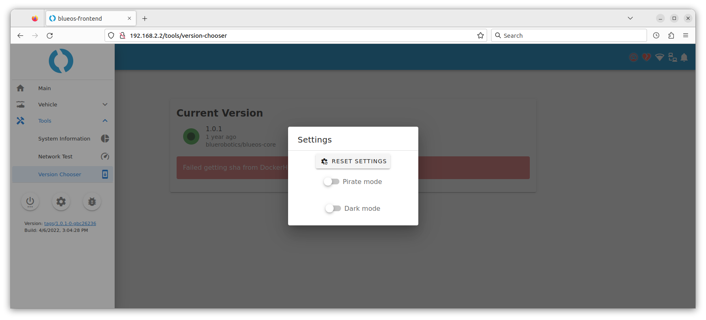
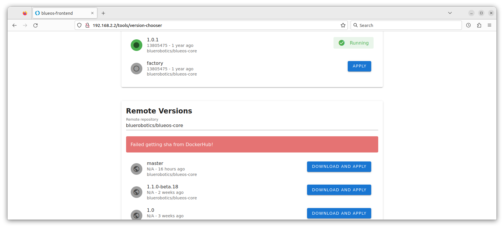
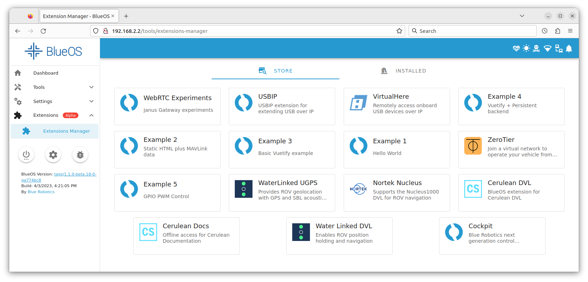
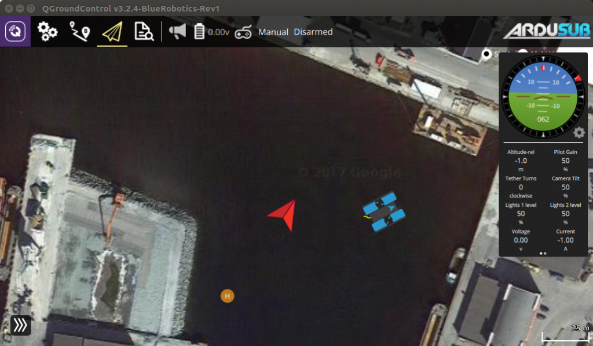

# Overview BlueROV2 integration

The Water Linked Underwater GPS G2 (from now UGPS) system can be integrated with a BlueROV2 from Blue Robotics in different ways, depending upon the choice of locator.

## Recommended integration methods

* We recommend you to use the [Locator-A1](../../locators/locator-a1) together with the [BlueROV2 Integration Kit](https://waterlinked.com/shop/underwater-gps-g2-bluerov2-integration-kit-103) when integrating the UGPS system with the BlueROV2. The integration steps are described in [BlueROV2 Integration Locator-A1](bluerov-integration-a1.md). You need to do hardware modifications to the ROV, FXTI and UGPS Topside which serve two purposes: A spare twisted wire pair in the tether is used to connect the Locator-A1 and the UGPS Topside. Secondly, the UGPS Topside is connected directly to the communication between ROV and topside computer. The advantages are that no additional topside computer configuration is required and thus the integration works well across operating systems. Once installed, the Locator-A1 requires least user interaction, e. g. no accumulator needs to be charged.

* If you want to avoid hardware modifications, we recommend you to use the [Locator-U1](../../locators/locator-u1). The locator can simply be attached to the BlueROV2 in any convenient way. However some configuration steps in the topside computer are required to establish a network bridge, so the position calculated by the UGPS Topside is available to the autopilot and with that in QGroundControl. These steps are described in [BlueROV2 Integration Locator-U1](bluerov-integration-u1.md). Be aware that setting up a network bridge in operating systems other than Windows can be challenging.

## Alternative integration methods

* To integrate the [Locator-A1](../../locators/locator-a1) it is possible to only perform modifications to the BlueROV2 and FXTI to route the analog signal from the UGPS Topside through the FXTI and a spare twisted wire pair in the tether to the Locator-A1. Instead of modifying the UGPS Topside to connect directly to the communication between ROV and topside computer, a network bridge like recommended for the Locator-U1 has to be established. The steps in these sections are relevant
    * [Modifications to the BlueROV2](bluerov-integration-a1.md#modifications-to-the-bluerov2)
    * [Modifications to the FXTI](bluerov-integration-a1.md#modifications-to-the-fxti) with the deviation that the blue/white twisted pair between Tether Connection PCB and Binder-connector-pigtail-assembly does not need to be connected.
    * [Establish a network connection with a network bridge](bluerov-integration-u1.md#establish-a-network-connection-between-ugps-topside-bluerov2-and-topside-computer)
    * [Final steps](#final-steps-of-integration-independent-of-locator)

* To integrate the [Locator-U1](../../locators/locator-u1) it is possible to not use the recommended network bridge solution, but modify the FXTI and UGPS Topside with the help of the [BlueROV2 Integration Kit](https://waterlinked.com/shop/underwater-gps-g2-bluerov2-integration-kit-103) to connect directly to the communication between ROV and topside computer. The steps in these sections are relevant
    * [Mount the Locator-U1 to the BlueROV2 frame](bluerov-integration-u1.md#mount-the-locator-u1-to-the-bluerov2-frame)
    * [Modifications to the UGPS Topside](bluerov-integration-a1.md#modifications-to-the-ugps-topside)
    * [Modifications to the FXTI](bluerov-integration-a1.md#modifications-to-the-fxti) with the deviation that the green/white twisted pair between tether and Binder-connector-pigtail-assembly does not need to be connected.
    * [Establish a network connection with powerline communication](bluerov-integration-a1.md#establish-a-network-connection-between-ugps-topside-bluerov2-and-topside-computer)
    * [Final steps](#final-steps-of-integration-independent-of-locator)

* If using a [Locator-D1](../../locators/locator-d1), the simplest option is to use the D1's cable, and attach the D1 locator to the BlueROV2 in any convenient way. No further hardware integration is then required. As with the Locator-U1,
    * [Establish a network connection with a network bridge](bluerov-integration-u1.md#establish-a-network-connection-between-ugps-topside-bluerov2-and-topside-computer)
    * and follow the [final steps](#final-steps-of-integration-independent-of-locator)

* To use the ROV tether rather than the [Locator-D1](../../locators/locator-d1) modifications similar to the recommended Locator-A1 integration are necessary. This is an option if the ROV has a fiber-optic tether (the Locator-A1 cannot be used in that case). The next section describes this in more detail.

### Integration via the BlueROV2 tether when using a Locator-D1

There are two options. The one we recommend is to proceed exactly as when [connecting the UGPS G2 topside to the A1 locator using the BlueROV2 tether](bluerov-integration-a1.md), except that where the green and white twisted pair of the A1 locator is referred to, instead both the orange and white twisted pair and the blue and white twisted pair of the [D1 locator](../../locators/locator-d1) should be used. Thus one will require three twisted pairs in the BlueROV2 tether if the [FXTI approach](bluerov-integration-a1.md#modifications-to-the-fxt) to establishing a network connection between the UGPS G2 topside and the BlueROV2 is chosen, and two if the [network bridge](bluerov-integration-u1.md#establish-a-network-connection-between-ugps-topside-bluerov2-and-topside-computer) approach is chosen. If taking this approach, 'A1 locator' should be selected in the [GUI locator config](../../gui/settings/#locator-setup), not 'D1 locator' ('D1 locator' should only be selected if using the D1 locator with its supplied cable).

If using a fiber-optic tether, the A1 locator cannot be used, as the electrical signal sent via the green and white pair can not easily be converted to an optical one. However, the D1 locator can be used via the integration of the previous paragraph, with the addition that a converter from RS-422 to optical should be used in between the UGPS G2 topside box and the tether, and a converter from optical to RS-422 should be used at the BlueROV2 end between the tether and the Locator-D1.

!!! Note
	Precise measurement of time-of-flight is crucial to the accuracy of the UGPS G2 positioning.
	Thus it is important that any latency from making conversions between RS-422 and optical signals is negligible. Latency of the order of nano-seconds, which many converters have, is fine.

The other option is the same, except all twisted pairs of the D1 locator are used in the integration, rather than only two of them. This will enable the UGPS G2 topside to receive the depth of the locator from its depth sensor, and the [step](bluerov-integration-u1.md#establish-a-network-connection-between-ugps-topside-bluerov2-and-topside-computer) of establishing a network connection between the UGPS G2 topside unit and the BlueROV2 can be skipped. This requires three twisted pairs in the BlueROV2 tether. In this case, 'D1 locator' should be selected in the [GUI locator config](../../gui/settings/#locator-setup). This option is again possible in the case of a fiber-optic tether by means of conversion to and from RS-422 and optical.

!!! Note
        The depth sensor of the D1 locator is likely to be less accurate than the BlueROV2's depth sensor, and it is for this reason that we recommend to integrate the D1 locator as if it were an A1 locator, in the manner described in the first paragraph of this section.

## Final steps of integration independent of Locator

If you have successfully installed a Locator with one of the above linked guides, these are the final configuration steps to be performed.

### BlueROV Software Update and UGPS extension

??? Info "Your BlueROV2 runs BlueOS"

	This section is for the R4 version of the BlueROV2 that uses the [Navigator Flight Controller](https://bluerobotics.com/store/comm-control-power/control/navigator/) or ROVs that have been upgraded to [BlueOS](https://docs.bluerobotics.com/ardusub-zola/software/onboard/) software.

	!!! Info

		If you have an older R1, R2, or R3 version of the BlueROV2 that uses a Pixhawk autopilot and you want to upgrade to using BlueOS, you can either do a software upgrade only [(described here)](https://docs.bluerobotics.com/ardusub-zola/software/onboard/BlueOS-1.1/installation/) or upgrade the hardware from Pixhawk to Navigator flight controller and the software [(described here)](https://bluerobotics.com/learn/navigator-retrofit-guide/).

	The Water Linked UGPS system requires an extension in BlueOS to be able to communicate with the autopilot. BlueOS has to be updated to **BlueOS 1.1.0-beta.18** or newer to assure that extensions are supported sufficiently. The process of updating to the latest beta-release is described below together with enabling the UGPS extension. Make also sure you use the most recent stable release of QGroundControl for your operating system.

	[//]: # ( TODO replace below update section as soon as BlueOS1.1 is released without beta with this text: Follow the Update Software section of the BlueROV Software Setup guide https://bluerobotics.com/learn/bluerov2-software-setup/#update-software)

	Turn on the ROV, connect it with the FXTI to your computer and open its web interface in a browser [(details described here)](https://bluerobotics.com/learn/bluerov2-software-setup/#update-software).

	To update BlueOS to a beta-release, "Pirate Mode" has to be enabled. In the BlueOS web interface, click the cog-wheel in the side menu and turn on "Pirate Mode" in the pop-up window.

	

	Navigate to "Version Chooser", which should now also show beta-releases in the section "Remote Versions". Click on "Download and apply" next to the latest available beta-release, here "BlueOS 1.1.0-beta.18". The update process can take some time.

	

	After a successful update you should see the chosen version in your "Local Versions".

	

	To enable the UGPS extension navigate to the "Extensions Manager", that should show up in the side bar after the above described BlueOS update.

	Click on the "Water Linked UGPS" extension.

	

	In the pop-up make sure the latest version (> 1.0.4) is selected and click "Install".

	

	The extension should show up in the "Installed" tab.

	

??? Info "Your BlueROV2 runs Ardusub Companion"

	This section is for older R1, R2, or R3 versions of the BlueROV2 that use a Pixhawk autopilot and [Companion](https://www.ardusub.com/introduction/required-software/companion-computer-software.html) software.

	To work properly, the Water Linked UGPS system requires ArduSub Companion image version **0.0.21** or newer and the most recent stable release of QGroundControl for your operating system. If your Companion image is out of date, please follow the BlueROV2 Software [Update procedures](https://bluerobotics.com/learn/bluerov2-software-setup-r3-and-older/#update-software).

	!!! Note
		No special extension for the UGPS system is necessary in Companion OS. It is natively supported.

### Checking UGPS to autopilot connection on land

If you open QGroundControl you should be able to establish a connection to the ROV as before UGPS integration. Furthermore you should be able to see messages of type `GPS_INPUT` in the MAVLink Inspector (click on Q-logo, then Analyze Tools, then MAVLink Inspector in sidebar). This is the MAVLink message that is provided by the UGPS BlueROV Extension to the autopilot. For detailed information about the extension see the [BlueOS Extension for UGPS GitHub page](https://github.com/waterlinked/blueos-ugps-extension).

## Daily operation

This section will help you if a UGPS system was already integrated with the BlueROV2 and you want to use and not also install it.

1. Follow the instructions of the UGPS Quickstart-Guide from the Water Linked Documentation for [antenna](../quickstart.md#antenna) or [loose receivers](../quickstart.md#loose-receivers) deployment.
2. Connect BlueROV2, FXTI, topside computer and UGPS Topside and assure the network connection is working:
    * For the Locator-A1, follow [this section](bluerov-integration-a1.md#establish-a-network-connection-between-ugps-topside-bluerov2-and-topside-computer)
    * For the Locator-U1, follow [this section](bluerov-integration-u1.md#establish-a-network-connection-between-ugps-topside-bluerov2-and-topside-computer). In addition, note the channel setting in the Locator-U1 and close the lid to power it up.
3. Follow the steps of the [Quickstart-Guide](../quickstart.md#select-locator-and-channel-in-the-gui) from the Water Linked Documentation for:
    * Selecting the locator in the GUI
	  * Configuring antenna/receiver placement and search range.
	  * Setting of heading.
4. Start QGroundControl and verify the connection to the BlueROV2. Even if the ROV can not have a location fix above water it should now receive data from the UGPS system. See [Checking UGPS to autopilot connection on land](#checking-ugps-to-autopilot-connection-on-land)
5. Dive the BlueROV2 so the Locator is submerged a few centimeters below the surface.

If everything is operating correctly, you should now find a ROV position on the map in QGroundControl. The ROV position is indicated by a BlueROV2 image. The position of the surface vessel or Water Linked UGPS Topside housing is indicated by a red arrow or Q-symbol depending of QGroundControl version. The small ‘H’ icon indicates the ‘home position’, the location of the ROV’s first GPS lock.

!!! Note "UGPS Topside position"
	The UGPS topside position is not shown reliably on all systems. It is sent as NMEA to UDP port 14401, so check your configuration in QGroundControl.

## Troubleshooting

### 'No External Depth' error in UGPS Topside GUI, or QGroundControl connection issues (for Ardusub Companion)

This almost certainly means that the network between the UGPS G2 topside and the BlueROV2 has not been successfully established. First carry out the following steps:

1. Ensure you are using the latest versions of ArduSub Companion and QGroundControl: [Update Software](https://bluerobotics.com/learn/bluerov2-software-setup/#update-software)
2. In the Companion Web Interface, go to the [MAVProxy](http://www.ardusub.com/operators-manual/companion-web.html#mavproxy) page: [http://192.168.2.2:2770/mavproxy](http://192.168.2.2:2770/mavproxy)
3. Click on the “Restore Default Options” button.
4. Power cycle the BlueROV2.
5. Check the PLC LED (3) on the [PLC module](bluerov-integration-a1.md#install-the-plc-module) (see box "What do the LEDs on the PLC module mean?")

If the issue persists, if you are using the FXTI approach to the networking, you may wish to try the network bridge approach, as the FTXI sometimes fails to handle the connections satisfactorily. In addition, double-check that you did not skip the [Mofifications to the FXTI](bluerov-integration-a1.md#modifications-to-the-fxti).

If none of this solves the problem, you are very welcome to [contact us](https://waterlinked.com/support), and we will be happy to support you.

### Connection to BlueROV2 lost when connecting Underwater GPS to FXTI

The current draw by the FXTI can exceed 500 mA when connecting the Underwater GPS to the PLC network. This can then cause the FXTI to become unstable if it's connected to a standard USB 2.0 port on the computer since USB 2.0 allows for a maximum of 500 mA current draw. There are two known solutions:

1. Connect the USB cable of the FXTI to a USB 3.0/3.1 compatible USB-A port. USB 3.0/3.1 allows for a maximum of 900 mA current draw. A USB 3.0/3.1 compatible USB-A port should be recognized by its blue plastic parts.

2. Add a separate power source to the [Fathom-X](https://bluerobotics.com/store/comm-control-power/tether-interface/fathom-x-tether-interface-board-set-copy/) inside the FXTI. The Fathom-X board has screw terminals marked BATT which can attach to a 7-28V DC power source.

## Water Linked software updates

Keep the Water Linked software [up to date](../../sw-update). The GUI should notify when an update is available, but the current version can also be checked at [192.168.2.94/#/about](http://192.168.2.94/#/about).