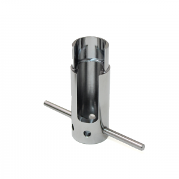
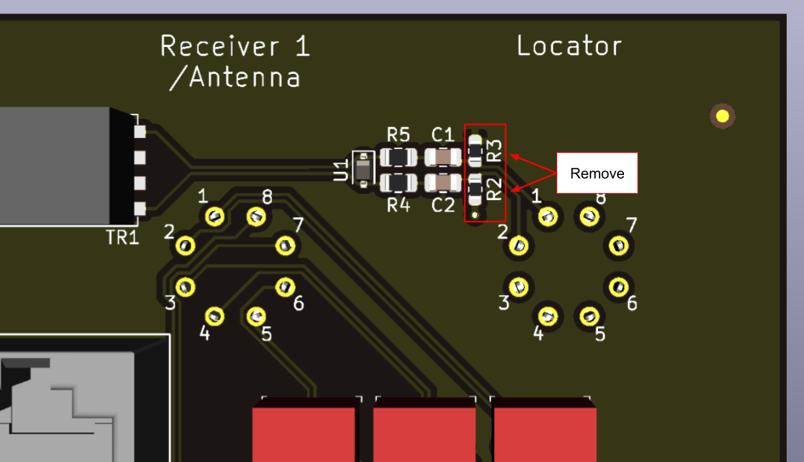
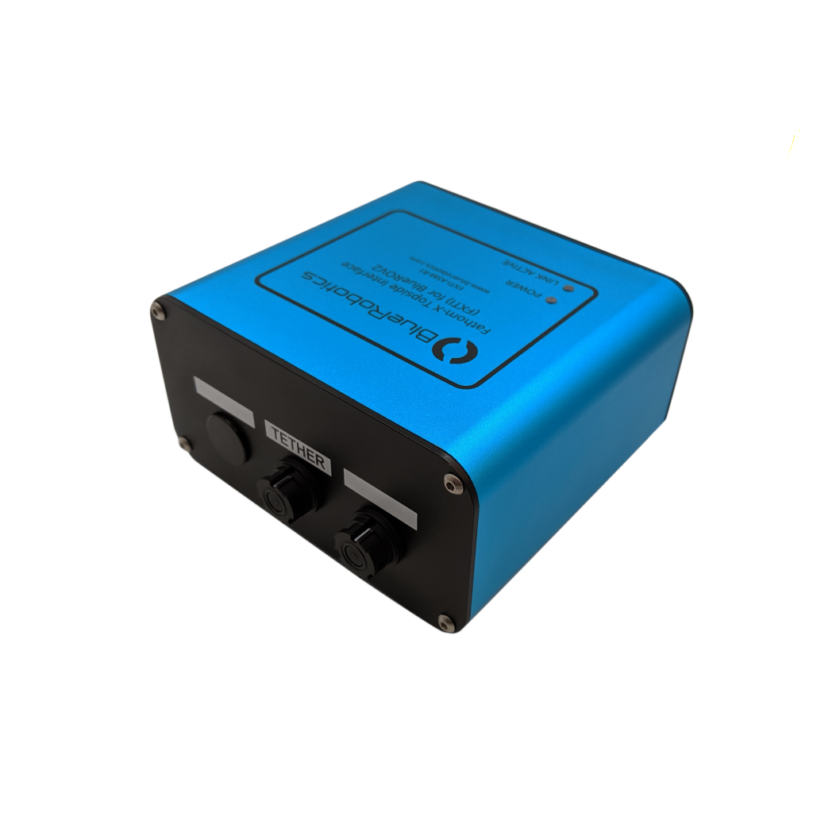

## Introduction

The revised Water Linked Underwater GPS is designed with a connection interface that has power-line communication (PLC) capabilities through the [BlueROV2 Integration Kit](https://store.waterlinked.com/product/bluerov2-integration-kit/).

The Water Linked BlueROV2 Integration Kit provides the necessary components to seamlessly connect the BlueROV2 and the Underwater GPS.

The following steps specifically covers using the [BlueROV2 Integration Kit](https://store.waterlinked.com/product/bluerov2-integration-kit/) to connect the Underwater GPS with the BlueRobotics BlueROV2. For other configurations, see [BlueROV2 integration without integration kit](#bluerov2-integration-without-integration-kit).

## Parts and tools

The [Locator-A1](../../locators/locator-a1.md) and [Locator-U1](../../locators/locator-u1.md) are the only Locators that will work together with the BlueROV2 Integration Kit as the Locator bulkhead on the Underwater GPS will be altered and used for connection to the BlueROV2. For other Locators, see [BlueROV2 integration without integration kit](#bluerov2-integration-without-integration-kit).

### You will need

* [BlueROV2](https://bluerobotics.com/store/rov/bluerov2/bluerov2/)

* [Hex Key Set](https://bluerobotics.com/store/watertight-enclosures/enclosure-tools-supplies/tool-hex-set-r1/)

* [Penetrator Wrench](https://bluerobotics.com/store/cables-connectors/tools/tool-penetrator-wrench-r1/)

* [BlueROV2 Integration Kit](https://store.waterlinked.com/product/bluerov2-integration-kit/)

You will also need:

* \#1 Phillips head screwdriver

Optional:

* Bottle of threadlocker
* Soldering iron

## Installing the Locator-A1 on the BlueROV2

You will need to install the Locator-A1 on the BlueROV2 using components from the BlueROV2 Integration Kit. The Locator will use one of the spare cable penetrations in the back of the BlueROV2 and will connect to the spare green and white twisted pair in the tether.

!!! Note
	The Locator-A1 requires a mounting bracket to attach it to the BlueROV2. You can find a 3D model of a suitable mounting bracket [here](https://waterlinked.com/wp-content/uploads/2017/06/Locator_A1_Mounting_Bracket.zip) which you can 3D print as is, or modify to your needs. Alternatively you can simply attach the Locator-A1 to the BlueROV2 using zip ties. Just make sure the Locator-A1 has free line-of-sight towards the Receivers near the surface.

### Removing a blank penetrator

To remove a blank penetrator from your BlueROV2, you will need the following tools:

* 2.5 mm hex driver
* \#1 Phillips head screwdriver
* Penetrator wrench

To ensure your ROV is completely powered off, please remove the battery completely from the 3” enclosure and place to the side.

Remove the fairings and buoyancy blocks by removing the self-tapping screws that hold the fairings to the frame.

Remove the 4” electronics enclosure from the ROV by removing the M3x16 screws that mount the enclosure to the ROV cradle.

Remove the Vent Plug from the Vent Penetrator Bolt on the electronics enclosure. Remove the 4″ tube and forward dome assembly from the rear end cap.

Remove the blank penetrator as pictured from the 4” End Cap with the penetrator wrench that came with the BlueROV2 kit.

### Install Locator-A1 penetrator

To install Locator-A1 into the end cap, you will need the following parts and tools:

* Locator-A1 with pre-installed cable penetrator
* Penetrator Nut (Black)
* Penetrator O-ring
* Silicone Grease – 10g Tube
* Isopropyl Alcohol Wipe
* Penetrator wrench

Wipe the exterior surface of the electronics enclosure end cap clean with isopropyl alcohol or isopropyl alcohol wipes, and make sure it is free of any particles in the areas where the penetrator O-ring will sit.

Remove the O-ring from the bag and apply silicone grease to it.

Install the O-ring onto the Locator-A1 cable penetrator.
Install the Locator-A1 cable penetrator on to the end cap in the hole you previously removed the blank penetrator from. Tighten to finger tight, then use the provided wrench to tighten it an additional ~1/16 of a turn. If you can’t loosen it with your fingers, it is tight enough.

Using the pre-crimped header pin connector on the Locator-A1, connect the Locator wires (green/white) to a spare twisted pair of the tether (green/white).

### Reasemble BlueROV2 electronics enclosure

To reassemble your BlueROV2 Electronics Enclosure, you will need the following parts and tools:

* 4 x M3x16 screws that were placed off to the side during disassembly
* Silicone Grease – 10g Tube
* 2.5 mm hex driver

Reinstall 4” Watertight Enclosure onto ROV with the following steps:

Apply silicone grease to the two radial O-rings on the O-Ring Flange (4” Series) that is attached to the Electronics Tray then install the Watertight Enclosure (4” Series) with installed Dome End Cap to the O-Ring Flange (4” Series).

Mount the Electronics Enclosure to the frame using the M3x16 screws so that the dome is on the same side as the front center panels (the center panels without the 3 large holes). Install the M3x16 screws through the clips and into the Enclosure Cradle (4” Series). It is easier to install these screws if the clips are not fully tightened until all screws are through the clips and threading into the Enclosure Cradle (4” Series). This allows clips to rotate so you can find the threaded hole in the Enclosure Cradle (4” Series) easily.

### Mounting the Locator-A1 to the BlueROV2 frame

To mount the Locator-A1 to the BlueROV2 frame, you will need the following parts and tools:

* Aluminum Locator-A1 mounting bracket (2 halves)4 x M3x16 socket head cap screws (Not included)
* 2 x M5x12 button head cap screws
* 2.5 mm hex driver
* 3 mm hex driver
* (Optional) Bottle of threadlocker

Route the Locator to one side of the ROV.

Attach the aluminum mounting bracket to the Locator-A1 using the M3x16 socket head screws. (Optional) add threadlocker to screw threads before securing.

Secure the mounting bracket to the existing holes on the ROV frame.

## Modifications inside Underwater GPS housing

### Connecting ethernet cable

To connect ethernet from the Interface Electronics board to the Master Electronics board, you will need the following part:

* Ethernet cable (included in the BlueROV2 Integration Kit)

Locate the ethernet ports on the Interface Electronics board and the Master Electronics board.

Connect the included ethernet cable to the two ports.

### Installing the PLC module

To install the PLC module to the Interface Electronics board, you will need the following part:

* LX200V30 PLC Homeplug module with press-fit standoffs(included in the BlueROV2 Integration Kit)

Locate the socket for the Homeplug module on the Interface board.

Press the PLC module into the socket, making sure that the press-fit standoffs latch into the holes in the Interface Electronics board.

### Interface Electronics modification

!!! Warning
	Skipping this step leaves a regulated 12V power source from the Underwater GPS on the PLC lines (pins 1 (GND) and 2 (12V) on the Locator bulkhead). Connecting non-isolated equipment to the PLC lines may damage the Underwater GPS or any external equipment.

The Interface Electronics board in the Underwater GPS housing comes with the resistors R2 and R3 which put GND on pin 1 and 12V on pin 2 of the bulkhead connector with the label “Locator”. The configuration of the FXTI, BlueROV2 and the Underwater GPS G2 *are* affected by leaving these resistors on the board, so they *must* be removed for normal operation. The resistors can be removed using a soldering iron. Note that Locator-D1 cannot be used unless the resistors are soldered back on to the Interface Electronics.

## Modifications to FXTI

The connections made inside the FXTI will connect the ROV, Topside Computer, and Water Linked systems to each other. Here’s a high level diagram of what that will look like:

To enable connection between the Underwater GPS and the FXTI, you need the following parts and tools:

* Bulkhead wire assembly (included in the BlueROV2 Integration Kit)
* Brown/white jumper lead (included in the BlueROV2 Integration Kit)
* 2 mm hex driver

Unscrew the bulkhead panel from the FXTI and remove one of the black plastic plugs from one of the auxiliary ports.

Thread the FXTI Binder pigtail wire assembly into the open port and secure in place with the included bulkhead nut.

Connect the blue and white wire pair into the FXTI Tether Connection PCB matching the orientation of the pre-installed blue and white wire connections.

Connect the green and green/white Locator-A1 wire pair into the brown and brown/white pair on the Binder connector pigtail with the included female-to-female adapter.

Reassemble the FXTI box.

## ArduSub Companion software update

To work properly, the Water Linked UGPS system requires ArduSub Companion image version **0.0.21** or newer and the most recent stable release of QGroundControl for your operating system. If your Companion image is out of date, please follow the BlueROV2 Software [Update procedures](http://docs.bluerobotics.com/brov2/software-setup/#update-software).

## Software setup

1. Configure the Water Linked system with a static IP address of 192.168.2.94 according to the [Network section](../network-settings.md) of the Water Linked Documentation.

2. Connect the topside computer to the FXTI and configure the topside computer to static IP address 192.168.2.1.

3. Connect the BlueROV2 to the FXTI and power the BlueROV2 normally.

4. Start QGroundControl and verify the connection to the BlueROV2.

5. Connect the FXTI to the Water Linked Box using the deck extension cable from the BlueROV2 Integration Kit.

6. Follow the [Quickstart](../quickstart.md) from the Water Linked Documentation for:
	* Powering the Water Linked box.
	* Calibrating the IMU.
	* Deploying receivers.
	* Making Antenna/Receiver-D1 connections to the box.

7. To configure the receiver locations on the Water Linked Underwater GPS system, navigate to `http://192.168.2.94/#/receivers` in your browser. Please refer to the [Receivers section](../../receiver-d1.md) for further information on configuration.

8. Dive the BlueROV2 so the Locator is submerged a few inches below the surface.

If everything is operating correctly, you should now find an ROV position on the map in QGroundControl. The ROV position is indicated by a BlueROV2 image. The position of the surface vessel or Water Linked Master Electronics housing is indicated by a red arrow. The small ‘H’ icon indicates the ‘home position’, the location of the ROV’s first GPS lock.

## Troubleshooting

### No External Depth error

If the error message *No external depth received. Is it being sent correctly?* is displayed in the UGPS UI, then conduct the following:

1. Ensure you are using the latest versions of ArduSub Companion and QGroundControl: [Update Software](https://bluerobotics.com/learn/bluerov2-software-setup/#update-software)
2. In the Companion Web Interface, go to the [MAVProxy](http://www.ardusub.com/operators-manual/companion-web.html#mavproxy) page: [http://192.168.2.2:2770/mavproxy](http://192.168.2.2:2770/mavproxy)
3. Click on the “Restore Default Options” button.
4. Power cycle the BlueROV2.

### Slow or no connection

If QGroundControl is not able to connect to the BlueROV2 and [192.168.2.94](http://192.168.2.94/#) is unavailable, there may be some issue with the PLC Homeplug network. Try the following:

1. Make sure you did not skip [Interface Electronics modification](#interface-electronics-modification).
2. Try isolating the problem by disconnecting the Underwater GPS G2 and ping the BlueROV2 on 192.168.2.2 in a terminal. Repeat for the Underwater GPS G2 by reconnecting the Underwater GPS G2 and disconnecting the BlueROV2. Ping 192.168.2.94

## Water Linked software update

Check the Water Linked system for available software updates. You can check the Underwater GPS software version at [192.168.2.94/#/about](http://192.168.2.94/#/about). The update process is documented in the [Software Update section](../sw-update.md).

## BlueROV2 integration without integration kit

It is possible to integrate the Underwater GPS G2 with the BlueROV2 *without* the BlueROV2 Integration Kit. What you need to make sure is that the Underwater GPS G2 and the BlueROV2 is on the same network. This can be achieved using a networking cable from the Master Electronics inside the Topside Housing to the computer which is connected to the FXTI. You will have to configure a bridged connection between the two networking interfaces for the Underwater GPS G2 to be able to communicate with the BlueROV2 through the computer.

### Locator-U1

The [Locator-U1](../../locators/locator-u1.md) is a battery powered and has an integrated depth sensor, therefore you only need to charge it, attach it to the BlueROV2, turn it on, and configure it in the [Underwater GPS GUI](../gui/settings.md).

### Locator-A1

The [Locator-A1](../../locators/locator-a1.md) needs to be integrated with the BlueROV2 following the steps in [Installing the Locator-A1](#installing-the-locator-a1-on-the-bluerov2) above. Since the Locator-A1 signals goes through the BlueROV2 tether and enters the FXTI, you will have to route the Locator-A1 signals to the *Locator* bulkhead on the Underwater GPS G2. The bulkheads on the Underwater GPS G2 mates with [Binder 770 Series NNC Miniature Cable Connectors](https://octopart.com/99-0771-002-08-binder-39031370) and uses pins 7 and 8 for the Locator-A1 signals. For the signal integrity of the Locator-A1 signal, use a Cat5e cable between the Topside and the FXTI. Using the Locator-A1, you will also need to provide external depth. See [Providing depth to system when using Locator-A1](./api.md#providing-depth-to-system-when-using-locator-a1) for more information.

### Locator-D1

The [Locator-D1](../../locators/locator-d1.md) comes with a seperate cable which must run parallel with the BlueROV2 tether to the Topside. Since the Locator-D1 is a stand-alone unit, no further integration with the BlueROV2 is needed.
