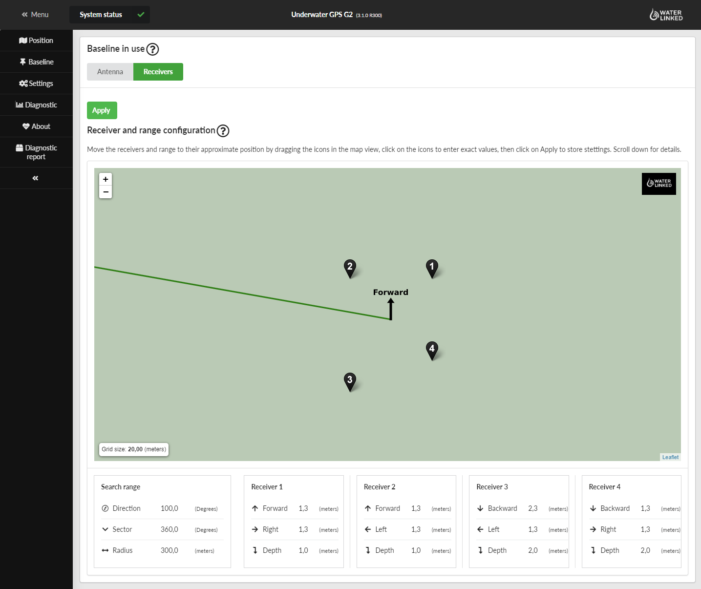

# Quickstart

## Intro

A quick guide on how to start using the Underwater GPS system:

* Power the topside unit
* Connect to the Underwater GPS topside box
* Deploy locator and antenna/receivers
* Select locator and channel in the GUI
* Configure antenna/receiver placement in the GUI
* Set heading

## Power the topside unit

Start by connecting power to the UGPS G2 topside box. The GPS receiver in the topside box will begin receiving signals and achieve a lock whilst we setup the rest of the system.

If you are using the Locator-U1, power it on now as well; it too will acquire a GPS lock whilst we setup the rest of the system.

If you are inside, use of a GPS repeater or similar will be necessary.

## Connect to the Underwater GPS topside box

Connect to the WiFi access point **UnderwaterGPS** on your PC/tablet/smartphone. The WiFi password is **waterlinked**. Navigate to [http://192.168.7.1/](http://192.168.7.1/) in a web browser to access the Underwater GPS web GUI.

## Deploy locator and antenna/receivers

### Locator

Attach the locator ([U1](../locators/locator-u1), [A1](../locators/locator-a1), or [D1](../locators/locator-d1)) to your vehicle. The [BlueROV2 integration guide](../integration/bluerov-integration) may be helpful if integrating an A1 or D1 locator with a vehicle tether.

If using an A1 or D1 locator, connect it to the 'Locator' bulkhead on the UGPS G2 topside box. The U1 connector is wireless, and this step can be omitted.

### Antenna

Unfold the [antenna](../../antenna) and lock the mast straight using the latches on the folding joints. Secure the three arms in place using the thumb screw. Place the antenna in water at the desired location. Secure the Antenna using the RAM Mount components included with the antenna.

Connect the antenna to the bulkhead marked 'Receiver 1/Antenna' on the UGPS G2 topside box (see the above picture).

!!! Tip
	If the RAM Mount components included with the antenna do not meet your needs, many alternative RAM Mount Arms and Bases are [available](https://www.rammount.com/shop-all/popular-components/c-size).

### Loose receivers

Before deploying the [receivers](../../receiver-d1) in the water, add a piece of tape to each receiver cable at the desired depth, to make [configuration](#configure-antennareceiver-placement-and-search-range) easier. Place the receivers in the water at the desired location, and connect one to each of the four bulkheads 'Receiver 1', 'Receiver 2', 'Receiver 3', and 'Receiver 4' of the UGPS G2 topside box (see the above picture).

!!! Tip
    Add a weight just above each receiver to improvement stability in the water.

## Select locator and channel in the GUI

Select the correct locator type in the [GUI settings](../gui/settings/), and choose which channel to listen on. Channel 2 is the default. If using a [Locator-U1](../locators/locator-u1/), ensure that its channel (set by completely unscrewing the lid and turning the dial inside) is set to the same as you configure in the GUI.

!!! Note
    If you are using the Locator-A1, depth information needs to be provided the topside unit by means of the UGPS [API](../integration/api). You can ignore this if following the [BlueROV2 integration guide](../integration/bluerov-integration).

## Configure antenna/receiver placement and search range

Provide the correct placement of the antenna/receivers relative to the topside box in the [GUI settings](../gui/settings/), and, if using an antenna, specify if it has been rotated from the default indicated in the GUI.

Specifically, for the antenna, enter the position and optionally the rotational angle manually under **Advanced settings**.

If using loose receivers, either drag and drop each receiver to its position, or enter the positions manually.

Limit the search area by changing its radius, direction or sector size in the GUI

!!! Tip
    Reducing the search area can improve the performance of the system, and we recommend to do this as far as possible, even if operating in a small area such as a tank or pool.

## Set heading

In the top bar of the GUI you will see a warning about missing heading. Click the link, click to zero the gyros, then set compass heading to a reference heading (e.g. from an analogue compass, compass app, or boat compass).

!!! info
    Setting the heading replaces IMU calibration as of release 3.3.0.

You are now ready to explore the underwater world while knowing where you are!
